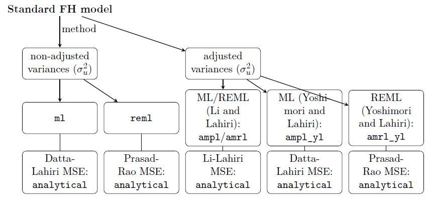

```{r setup, include=FALSE}
knitr::opts_chunk$set(echo = TRUE)
```

## Small introduction 

The `fh` function allows various estimation methods for the variance of the 
random effects and the mean squared error (MSE). 



### Load package and data


```{r loadData}
library("emdi")

data("eusilcA_popAgg")
data("eusilcA_smpAgg")
```


### Combine inout data

```{r combinedData}
## Combine input data
combined_data <- combine_data(pop_data = eusilcA_popAgg, 
                              pop_domains = "Domain", 
                              smp_data = eusilcA_smpAgg, 
                              smp_domains = "Domain")
```

### Identify spatial structures


```{r spatialStructure}
load_shapeaustria()
shape_austria_dis <- shape_austria_dis[order(shape_austria_dis$PB),]
austria_shape <- sp::merge(shape_austria_dis, eusilcA_smpAgg, by.x = "PB",
                       by.y = "Domain", all.x = F)
rel <- spdep::poly2nb(austria_shape, row.names = austria_shape$PB)
eusilcA_prox <- spdep::nb2mat(rel, style = "W", zero.policy = TRUE)

# Spatial correlation tests
spatialcor.tests(direct = combined_data$Mean, 
                 corMatrix = eusilcA_prox)
```

### Perform model selection

```{r modelSelection}
# Generate initial object of class "fh", "emdi"
fh_std <- fh(fixed = Mean ~ cash + self_empl + unempl_ben, 
             vardir = "Var_Mean", combined_data = combined_data, 
             domains = "Domain", method = "ml", B = c(0,50))
# Perform stepwise variable selection
step(fh_std, criteria = "KICb2")
```

### Estimate EBLUPs and MSEs

```{r estimation}
# Generate object of class "fh","emdi" with MSE estimation
fh_std <- fh(fixed = Mean ~ cash + self_empl, vardir = "Var_Mean", 
             combined_data = combined_data, domains = "Domain", 
             method = "ml", MSE = TRUE, B = c(0,50))
```

### Assess the estimated model

```{r diagnostics}
summary(fh_std)
plot(fh_std)
```


### Compare results with direct estimates                                 

```{r compare}
compare_plot(fh_std, CV = TRUE, label = "no_title")
compare(fh_std)
```

### Benchmarking for consistent estimates

```{r benchmark}
data("eusilcA_smp")
mean(eusilcA_smp$eqIncome)
fh_bench <- benchmark(fh_std, benchmark = 20140.09, 
                      share = eusilcA_popAgg$ratio_n, type = "ratio")
# Showing the first 6 rows of the results with head command
head(fh_bench)
```


### Extract and visualize the results

```{r extract}
head(estimators(fh_std, MSE = TRUE))
```


### Visualization of results on maps

```{r visualize}
# Load shape file 
load_shapeaustria()

# Maps with adjusted scales
map_plot(object = fh_std, MSE = TRUE, 
         map_obj = shape_austria_dis, map_dom_id = "PB",
         scale_points = list(Direct = list(ind = c(8000, 60000), 
                                           MSE = c(200000, 10000000)), 
                             FH = list(ind = c(8000, 60000),
                                       MSE = c(200000, 10000000))))
```

