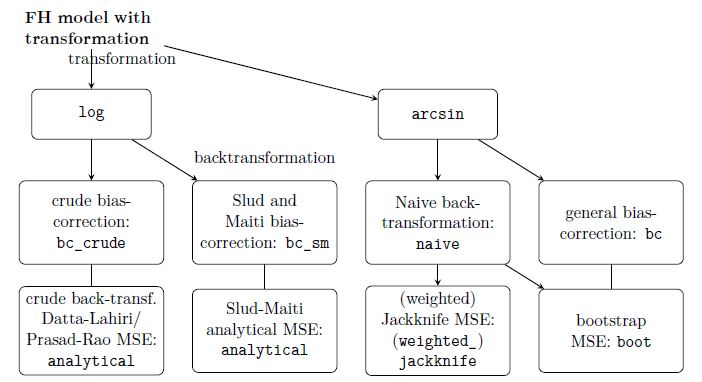

```{r setup, include=FALSE}
knitr::opts_chunk$set(echo = TRUE)
```

## Small introduction 

The `fh` function allows for two transformations: log and arcsin.



### Load package and data


```{r loadData}
library("emdi")

data("eusilcA_popAgg")
data("eusilcA_smpAgg")
```


### Combine inout data

```{r combinedData}
## Combine input data
combined_data <- combine_data(pop_data = eusilcA_popAgg, 
                              pop_domains = "Domain", 
                              smp_data = eusilcA_smpAgg, 
                              smp_domains = "Domain")
```

### Identify spatial structures


```{r spatialStructure}
load_shapeaustria()
shape_austria_dis <- shape_austria_dis[order(shape_austria_dis$PB),]
austria_shape <- sp::merge(shape_austria_dis, eusilcA_smpAgg, by.x = "PB",
                       by.y = "Domain", all.x = F)
rel <- spdep::poly2nb(austria_shape, row.names = austria_shape$PB)
eusilcA_prox <- spdep::nb2mat(rel, style = "W", zero.policy = TRUE)

# Spatial correlation tests
spatialcor.tests(direct = combined_data$Mean, 
                 corMatrix = eusilcA_prox)
```

### Estimate EBLUPs and MSEs

```{r log}
fh_log <- fh(fixed = Mean ~ cash + self_empl,
                vardir = "Var_Mean", combined_data = combined_data,
                domains = "Domain", transformation = "log", method = 'ml',
                backtransformation = "bc_sm", eff_smpsize = "n", MSE = TRUE,
                mse_type = "analytical")
```

### Assess the estimated model

```{r log_diagnostics}
summary(fh_log)
plot(fh_log)
```

### Compare results with direct estimates                                 

```{r log_compare}
compare_plot(fh_log, CV = TRUE, label = "no_title")
compare(fh_log)
```


### Extract and visualize the results

```{r log_extract}
head(estimators(fh_log, MSE = TRUE))
```


### Visualization of results on maps

```{r log_visualize}
# Load shape file 
load_shapeaustria()

# Maps with adjusted scales
map_plot(object = fh_log, MSE = TRUE, 
         map_obj = shape_austria_dis, map_dom_id = "PB",
         scale_points = list(Direct = list(ind = c(8000, 60000), 
                                           MSE = c(200000, 10000000)), 
                             FH = list(ind = c(8000, 60000),
                                       MSE = c(200000, 10000000))))
```


### Estimate EBLUPs and MSEs

```{r arcsin}
fh_arcsin <- fh(fixed = MTMED ~ cash + age_ben + rent + house_allow,
                vardir = "Var_MTMED", combined_data = combined_data,
                domains = "Domain", transformation = "arcsin",
                backtransformation = "bc", eff_smpsize = "n", MSE = TRUE,
                mse_type = "boot")
```

### Assess the estimated model

```{r diagnostics}
summary(fh_arcsin)
plot(fh_arcsin)
```


### Extract and visualize the results

```{r extract}
head(estimators(fh_arcsin, MSE = TRUE))
```


### Visualization of results on maps

```{r visualize}
# Load shape file 
load_shapeaustria()

# Maps with adjusted scales
map_plot(object = fh_arcsin, MSE = TRUE, 
         map_obj = shape_austria_dis, map_dom_id = "PB")
```

